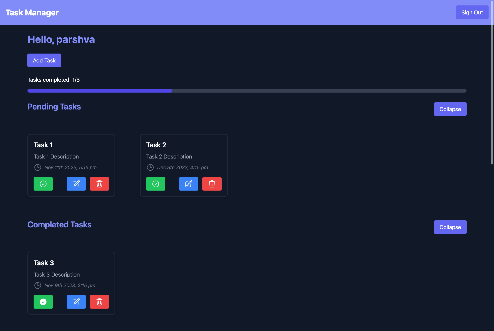

# FastToDo
FastToDo is a modern task manager application built using React.js and FastAPI.

## Features

- **Task Management**: FastToDo helps you efficiently manage your tasks, making it easy to organize and access your tasks.
- **React.js Frontend**: The frontend of FastToDo is built using React.js. along with TailwindCSS
- **FastAPI Backend**: FastAPI is a modern web framework for building RESTful APIs in Python
- **Database**: Postgres is used as database for this application. 

## Screenshots

### 1. Login Page

### 2. Register Page

### 3. Task Dashboard

- Access and create tasks.
- Easily edit and manage your tasks.